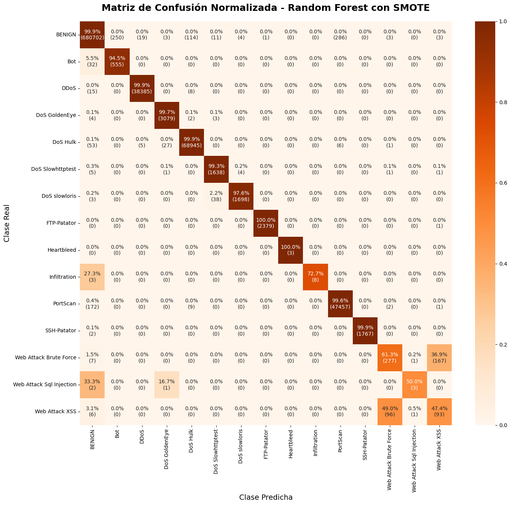

# Detector de Intrusiones de Red con Machine Learning

## Descripción

Este proyecto implementa un pipeline completo de Machine Learning para clasificar el tráfico de red como benigno o como uno de los 14 tipos de ataque, utilizando el dataset **CIC-IDS-2017**. El objetivo es comparar el rendimiento de diferentes modelos y optimizar su capacidad para detectar clases minoritarias mediante técnicas de balanceo de datos.

Este repositorio es el resultado de un proyecto guiado, enfocado en aplicar las mejores prácticas de la industria en cada fase del ciclo de vida de la ciencia de datos.

## Tabla de Contenidos

1.  [Dataset](#dataset)
2.  [Estructura del Proyecto](#estructura-del-proyecto)
3.  [Pipeline de Datos y Modelado](#pipeline-de-datos-y-modelado)
4.  [Resultados Clave](#resultados-clave)
5.  [Cómo Ejecutar este Proyecto](#cómo-ejecutar-este-proyecto)
6.  [Herramientas Utilizadas](#herramientas-utilizadas)

---

## Dataset

El dataset utilizado es el **CIC-IDS-2017**, generado por el Canadian Institute for Cybersecurity. Contiene tráfico de red capturado durante 5 días, con una mezcla de tráfico benigno y ataques comunes.

- **Fuente Original:** [CIC-IDS-2017 Dataset](http://cicresearch.ca/CICDataset/CIC-IDS-2017/)

- **Paper de Referencia:** Para citar el trabajo original, por favor refiérase al siguiente paper académico:
  > Sharafaldin, I., Lashkari, A. H., & Ghorbani, A. A. (2018). _Toward generating a new intrusion detection dataset and intrusion traffic characterization_. In Proceedings of the 4th International Conference on Information Systems Security and Privacy (ICISSP).

---

## Estructura del Proyecto

El análisis está dividido en varios notebooks secuenciales, cada uno con un propósito específico:

- **`notebooks/00_data_ingestion_and_optimization.ipynb`**: Carga los 8 archivos CSV originales, los une, realiza una limpieza fundamental (valores nulos, caracteres, etc.), optimiza los tipos de datos para reducir el uso de memoria en más de un 60% y guarda el resultado en un único archivo Parquet.
- **`notebooks/01_exploratory_data_analysis.ipynb`**: Realiza un análisis visual para entender la distribución de las clases (descubriendo un severo desbalance), el poder predictivo de las características individuales (usando histogramas y box plots) y la redundancia entre ellas (con una matriz de correlación).
- **`notebooks/02_feature_engineering_and_preprocessing.ipynb`**: Prepara los datos para el modelado. Esto incluye la selección de características (manual basada en EDA y automática con `SelectFromModel`), la división de datos en entrenamiento/prueba (`train_test_split` con estratificación) y el escalado de características (`StandardScaler`).
- **`notebooks/03_model_training_and_evaluation.ipynb`**: Entrena, evalúa y compara tres experimentos de modelos utilizando `Pipelines` para un flujo de trabajo robusto: Regresión Logística (baseline), Random Forest y Random Forest con datos balanceados por SMOTE.

---

## Pipeline de Datos y Modelado

El flujo de trabajo implementado sigue las siguientes fases:

1.  **Ingesta:** Se procesan más de 2.8 millones de registros de los archivos CSV y se consolidan en un archivo Parquet.
2.  **Análisis Exploratorio (EDA):** Se identifican características clave como `Flow Duration` y redundancias. Se confirma un severo desbalance de clases.
3.  **Preprocesamiento:** Se reduce la dimensionalidad de 78 a 39 características mediante `SelectFromModel` y se estandarizan los datos.
4.  **Modelado:**
    - Se establece un **baseline** con `LogisticRegression`, que muestra un buen rendimiento en clases mayoritarias pero falla en las minoritarias.
    - Se entrena un **`RandomForestClassifier`**, que mejora drásticamente la detección de ataques raros.
    - Se aplica **SMOTE** para balancear el conjunto de entrenamiento, logrando el mejor rendimiento general, especialmente en el `recall` de las clases con menos ejemplos.

---

## Resultados Clave

El modelo final y con mejor rendimiento fue el **Random Forest entrenado con datos balanceados por SMOTE**. Este modelo, aunque muestra signos de sobreajuste (`accuracy` de 1.00), es el más competente para la tarea:

- Mantiene un rendimiento casi perfecto en las clases mayoritarias.
- Mejora significativamente el `recall` de las clases ultra minoritarias, como `Web Attack Sql Injection` (de 17% a 50%) y `Bot` (de 78% a 95%).

Para un sistema de detección de intrusiones, donde es crítico minimizar los ataques no detectados (`recall` alto), este modelo es el claro ganador.



---

## Cómo Ejecutar este Proyecto

1.  **Prerrequisitos:** Tener instalado `conda` y `git`, incluyendo la extensión `git-lfs`.
2.  **Clonar el Repositorio:**
    ```bash
    git clone https://github.com/mauucrv/Detector-De-Intrusiones.git
    cd Detector-De-Intrusiones
    ```
3.  **Crear el Entorno:**
    ```bash
    conda create --name cic_ids_env python=3.11
    conda activate cic_ids_env
    conda install -c conda-forge --file requirements.txt
    ```
4.  **Ejecutar los Notebooks:** Abrir la carpeta en VS Code o Jupyter Lab y ejecutar los notebooks en orden numérico (`00` a `03`).

---

## Herramientas Utilizadas

- **Lenguaje:** Python 3.11
- **Librerías Principales:** Pandas, NumPy, Scikit-learn, Imbalanced-learn, Matplotlib, Seaborn, Joblib.
- **Control de Versiones:** Git y Git LFS.
- **Entorno:** Jupyter Notebook en VS Code.
