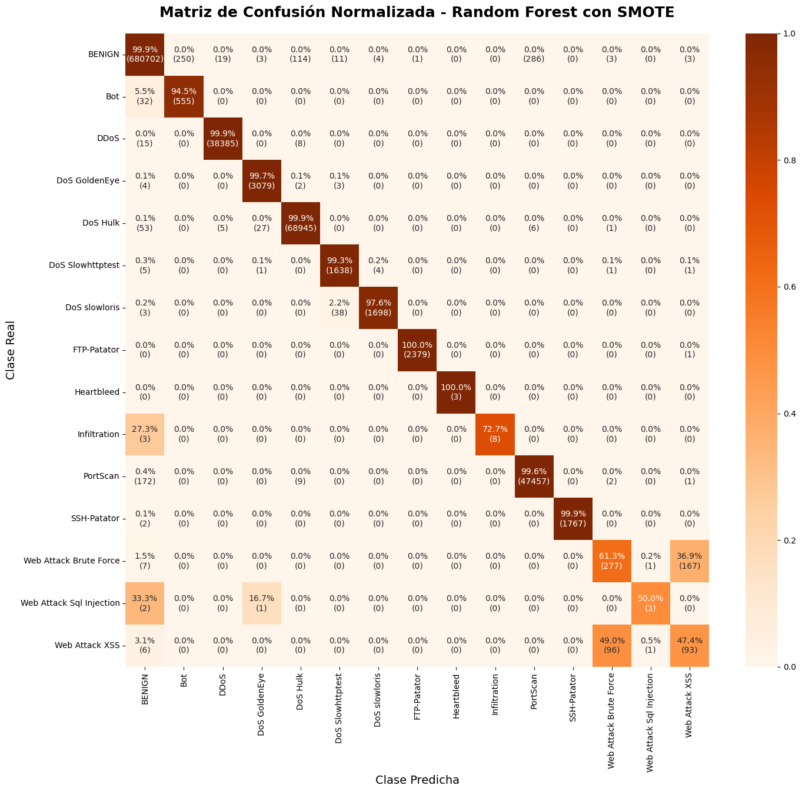

# Detector de Intrusiones de Red con Machine Learning

## Descripción

Este proyecto implementa un pipeline completo de Machine Learning para clasificar el tráfico de red como benigno o como uno de los 14 tipos de ataque, utilizando el dataset **CIC-IDS-2017**. El objetivo es comparar el rendimiento de diferentes modelos y optimizar su capacidad para detectar clases minoritarias mediante técnicas de balanceo de datos.

Este repositorio es el resultado de un proyecto guiado, enfocado en aplicar las mejores prácticas de la industria en cada fase del ciclo de vida de la ciencia de datos.

## Tabla de Contenidos

1.  [Dataset](#dataset)
2.  [Estructura del Proyecto](#estructura-del-proyecto)
3.  [Pipeline de Datos y Modelado](#pipeline-de-datos-y-modelado)
4.  [Resultados Clave](#resultados-clave)
5.  [Capacidades Avanzadas](#capacidades-avanzadas)
6.  [Cómo Ejecutar este Proyecto](#cómo-ejecutar-este-proyecto)
7.  [Herramientas Utilizadas](#herramientas-utilizadas)

## Dataset

El dataset utilizado es el **CIC-IDS-2017**, generado por el Canadian Institute for Cybersecurity. Contiene tráfico de red capturado durante 5 días, con una mezcla de tráfico benigno y ataques comunes.

- **Fuente Original:** [CIC-IDS-2017 Dataset](http://cicresearch.ca/CICDataset/CIC-IDS-2017/)

- **Paper de Referencia:** Para citar el trabajo original, por favor refiérase al siguiente paper académico:
  > Sharafaldin, I., Lashkari, A. H., & Ghorbani, A. A. (2018). _Toward generating a new intrusion detection dataset and intrusion traffic characterization_. In Proceedings of the 4th International Conference on Information Systems Security and Privacy (ICISSP).

## Estructura del Proyecto

El análisis está dividido en varios notebooks secuenciales, cada uno con un propósito específico:

- **`notebooks/00_data_ingestion_and_optimization.ipynb`**: Carga los 8 archivos CSV originales, los une, realiza una limpieza fundamental (valores nulos, caracteres, etc.), optimiza los tipos de datos para reducir el uso de memoria en más de un 60% y guarda el resultado en un único archivo Parquet.
- **`notebooks/01_exploratory_data_analysis.ipynb`**: Realiza un análisis visual para entender la distribución de las clases (descubriendo un severo desbalance), el poder predictivo de las características individuales (usando histogramas y box plots) y la redundancia entre ellas (con una matriz de correlación).
- **`notebooks/02_feature_engineering_and_preprocessing.ipynb`**: Prepara los datos para el modelado. Esto incluye la selección de características (manual basada en EDA y automática con `SelectFromModel`), la división de datos en entrenamiento/prueba (`train_test_split` con estratificación) y el escalado de características (`StandardScaler`).
- **`notebooks/03_model_training_and_evaluation.ipynb`**: Entrena, evalúa y compara tres experimentos de modelos utilizando `Pipelines` para un flujo de trabajo robusto: Regresión Logística (baseline), Random Forest y Random Forest con datos balanceados por SMOTE.

### Módulos Reutilizables (`src/`)

- **`src/data_utils.py`**: Utilidades de carga, limpieza y optimización de datos. Operaciones inmutables (no modifica los datos originales).
- **`src/feature_engineering.py`**: Funciones de feature engineering, preprocesamiento y selección con `SelectFromModel`.
- **`src/evaluation.py`**: Evaluación de modelos con separación de métricas y visualización. Incluye análisis de gap train/test para detectar sobreajuste.
- **`src/model_persistence.py`**: Serialización y deserialización de modelos con `joblib`, incluyendo metadatos.
- **`src/inference.py`**: Pipeline de inferencia para clasificar tráfico nuevo con un modelo entrenado. Ejecutable desde CLI.
- **`src/cross_validation.py`**: Validación cruzada estratificada (`StratifiedKFold`) con múltiples métricas.
- **`src/hyperparameter_tuning.py`**: Optimización de hiperparámetros con `RandomizedSearchCV` para cualquier estimator (RF, Gradient Boosting, etc.).
- **`src/temporal_validation.py`**: Validación temporal (split por día y walk-forward validation) para evaluación realista de IDS.
- **`src/advanced_feature_selection.py`**: Selección avanzada de features con RFECV y permutation importance.
- **`src/drift_detection.py`**: Detección de data drift y prediction drift para monitoreo en producción.
- **`src/exceptions.py`**: Excepciones personalizadas del proyecto.

## Pipeline de Datos y Modelado

El flujo de trabajo implementado sigue las siguientes fases:

1.  **Ingesta:** Se procesan más de 2.8 millones de registros de los archivos CSV y se consolidan en un archivo Parquet.
2.  **Análisis Exploratorio (EDA):** Se identifican características clave como `Flow Duration` y redundancias. Se confirma un severo desbalance de clases.
3.  **Preprocesamiento:** Se reduce la dimensionalidad de 78 a 39 características mediante `SelectFromModel` y se estandarizan los datos.
4.  **Modelado:**
    - Se establece un **baseline** con `LogisticRegression`, que muestra un buen rendimiento en clases mayoritarias pero falla en las minoritarias.
    - Se entrena un **`RandomForestClassifier`**, que mejora drásticamente la detección de ataques raros.
    - Se aplica **SMOTE** para balancear el conjunto de entrenamiento, logrando el mejor rendimiento general, especialmente en el `recall` de las clases con menos ejemplos.

## Resultados Clave

El modelo final y con mejor rendimiento fue el **Random Forest entrenado con datos balanceados por SMOTE**. Este modelo, aunque muestra signos de sobreajuste (`accuracy` de 1.00), es el más competente para la tarea:

- Mantiene un rendimiento casi perfecto en las clases mayoritarias.
- Mejora significativamente el `recall` de las clases ultra minoritarias, como `Web Attack Sql Injection` (de 17% a 50%) y `Bot` (de 78% a 95%).

Para un sistema de detección de intrusiones, donde es crítico minimizar los ataques no detectados (`recall` alto), este modelo es el claro ganador.

### Mitigación de Sobreajuste

Para abordar el sobreajuste observado, el proyecto incluye:

1. **Validación cruzada estratificada** (`StratifiedKFold`): Proporciona estimaciones más robustas del rendimiento del modelo al evaluar en múltiples particiones.
2. **Optimización de hiperparámetros** (`RandomizedSearchCV`): Busca automáticamente la mejor combinación de parámetros de regularización (`max_depth`, `min_samples_leaf`, `min_samples_split`, `max_features`).
3. **Análisis de gap train/test**: El módulo `evaluation.py` compara automáticamente el score de entrenamiento vs. prueba para detectar sobreajuste explícitamente.



## Capacidades Avanzadas

### Validación Temporal

El módulo `temporal_validation.py` implementa splits basados en el día de captura del tráfico, simulando un escenario realista donde el modelo entrena con datos históricos y predice tráfico futuro. Incluye **walk-forward validation** para evaluar la estabilidad del modelo a lo largo del tiempo.

### Selección Avanzada de Features

El módulo `advanced_feature_selection.py` complementa `SelectFromModel` con:
- **RFECV** (Recursive Feature Elimination con CV): elimina features iterativamente.
- **Permutation Importance**: mide la importancia real de cada feature sin sesgo de cardinalidad.
- **Comparación automática**: tabla comparativa de los tres métodos.

### Detección de Drift

El módulo `drift_detection.py` monitorea la degradación del modelo en producción:
- **Data drift**: test de Kolmogorov-Smirnov por feature para detectar cambios en las distribuciones de entrada.
- **Prediction drift**: test chi-cuadrado para detectar cambios en las distribuciones de predicciones.
- **`DriftMonitor`**: clase para monitoreo continuo por batches con alertas automáticas de reentrenamiento.

### Pipeline Generalizado de Tuning

El módulo `hyperparameter_tuning.py` ahora acepta cualquier estimator de scikit-learn, con distribuciones predefinidas para Random Forest y Gradient Boosting.

## Cómo Ejecutar este Proyecto

### Prerrequisitos

Tener instalado `conda` o `pip`, y `git` con extensión `git-lfs`.

### Instalación

```bash
git clone https://github.com/mauucrv/Detector-De-Intrusiones.git
cd Detector-De-Intrusiones

# Opción 1: pip (recomendado)
python -m venv venv
source venv/bin/activate  # En Windows: venv\Scripts\activate
pip install -e ".[dev]"

# Opción 2: conda
conda env create -f environment.yml
conda activate cic_ids_env
```

### Uso

```bash
# Ejecutar tests
make test
# o: pytest tests/ -v

# Verificar estilo
make lint
# o: ruff check src/ tests/

# Ejecutar pipeline completo
make pipeline

# Inferencia CLI
python -m src.inference data/models/best_model.joblib datos_nuevos.csv
```

### Ejecutar Notebooks

Abrir la carpeta en VS Code o Jupyter Lab y ejecutar los notebooks en orden numérico (`00` a `03`).

## Herramientas Utilizadas

- **Lenguaje:** Python 3.11
- **Librerías Principales:** Pandas, NumPy, Scikit-learn, Imbalanced-learn, Matplotlib, Seaborn, Joblib, SciPy.
- **Testing:** Pytest.
- **Linting:** Ruff.
- **CI/CD:** GitHub Actions.
- **Control de Versiones:** Git y Git LFS.
- **Entorno:** Jupyter Notebook en VS Code.
